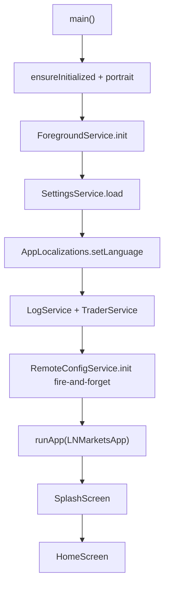

# Design — Aplicacao e Navegacao

## Componentes

| Componente | Responsabilidade | Evidencia | Confianca |
|---|---|---|---|
| `main()` | Bootstrap async, orientacao, servicos e `runApp`. | `app/lib/main.dart:14-35` | 🟢 |
| `LNMarketsApp` | Guarda servicos compartilhados e escolhe Splash/Home. | `app/lib/main.dart:38-74` | 🟢 |
| `HomeScreen` | Navegacao por tabs e layout responsivo. | `app/lib/screens/home_screen.dart:15-211` | 🟢 |
| `SplashScreen` | Tela inicial temporaria antes da Home. | `app/lib/screens/splash_screen.dart` | 🟢 |

## Fluxo

## Decisoes

- 🟢 Servicos sao criados uma vez no bootstrap e injetados por construtor, sem service locator.
- 🟢 `IndexedStack` preserva estado das tabs enquanto troca navegacao.
- 🟢 A ausencia de credenciais e tratada como decisao de UX, levando o usuario para Settings.

## Dependencias

- `settings-persistence` para idioma e credenciais.
- `trading-engine` para dashboard/start-stop.
- `logging-dashboard` para logs.
- `sponsors-remote-config` para partners.
- `background-service` para bateria/foreground task.
