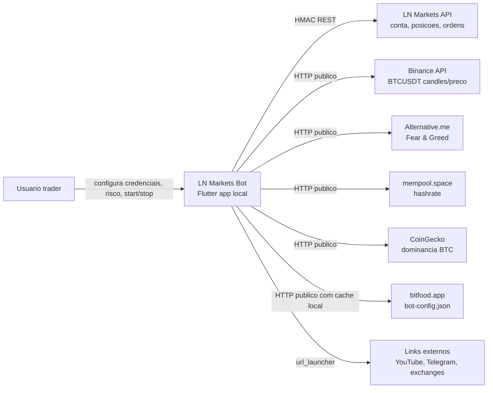
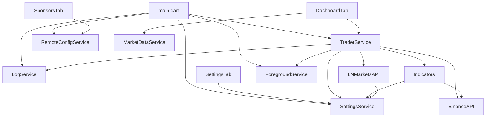
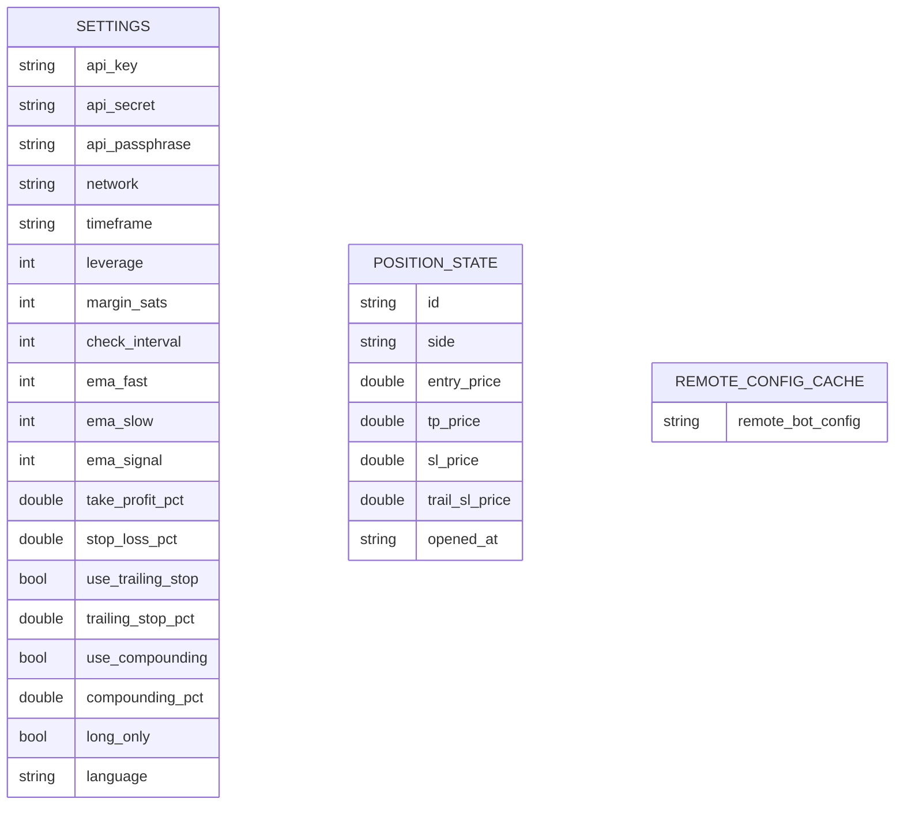

# Arquitetura — LN Markets Bot

Gerado em: 2026-06-05T05:00:59Z

Escala de confianca: 🟢 **CONFIRMADO** — extraido diretamente do codigo; 🟡 **INFERIDO** — baseado em padroes; 🔴 **LACUNA** — requer validacao humana.

## Resumo arquitetural

🟢 **CONFIRMADO** LN Markets Bot e um app Flutter client-side que executa a logica de trading no proprio dispositivo. Nao ha backend proprio no repositorio. O app conversa diretamente com LN Markets, Binance e APIs publicas de mercado por HTTP.

🟢 **CONFIRMADO** A aplicacao principal fica em `app/`, com suporte multiplataforma gerado por Flutter para Android, iOS, Linux, macOS, Web e Windows. O README destaca Android, mas o repositorio contem runners de desktop/web.

🟢 **CONFIRMADO** O estado persistente e local: `SharedPreferences` guarda credenciais, parametros de trading, posicao aberta e cache de config remota.

## C4 Contexto

## Containers logicos

| Container | Tecnologia | Responsabilidade | Evidencia | Confianca |
|---|---|---|---|---|
| Flutter UI | Flutter/Dart | Splash, navegacao, dashboard, settings, logs, sponsors, about | `app/lib/main.dart`, `app/lib/screens/` | 🟢 |
| Trading Engine | Dart `ChangeNotifier` + timers | Ciclo periodico, posicao, ordens, P&L | `app/lib/services/trader_service.dart` | 🟢 |
| Strategy Engine | Dart puro | EMA, cruzamento, BB, MACD e sinal | `app/lib/services/indicators.dart` | 🟢 |
| API Clients | Dart `http` | LN Markets, Binance, market data, remote config | `app/lib/services/*api.dart`, `market_data_service.dart`, `remote_config_service.dart` | 🟢 |
| Local Persistence | `shared_preferences` | Configuracoes, posicao aberta, cache remoto | `settings_service.dart`, `trader_service.dart`, `remote_config_service.dart` | 🟢 |
| Foreground Service | `flutter_foreground_task` | Manter execucao em background com notificacao | `foreground_service.dart` | 🟢 |

## Componentes principais

## Dados e persistencia

🟢 **CONFIRMADO** Nao ha banco de dados. O armazenamento local e chave-valor.

## Integracoes

| Sistema externo | Direcao | Protocolo | Dados | Evidencia | Confianca |
|---|---|---|---|---|---|
| LN Markets | App -> API | HTTPS REST + HMAC headers | conta, posicoes, ordens, TP/SL | `app/lib/services/lnmarkets_api.dart` | 🟢 |
| Binance | App -> API | HTTPS REST publico | candles e ticker BTCUSDT | `app/lib/services/binance_api.dart` | 🟢 |
| Alternative.me | App -> API | HTTPS REST publico | Fear & Greed | `app/lib/services/market_data_service.dart` | 🟢 |
| mempool.space | App -> API | HTTPS REST publico | hashrate 3d | `app/lib/services/market_data_service.dart` | 🟢 |
| CoinGecko | App -> API | HTTPS REST publico | BTC dominance | `app/lib/services/market_data_service.dart` | 🟢 |
| bitfood.app | App -> API | HTTPS JSON | links/status de exchanges | `app/lib/services/remote_config_service.dart` | 🟢 |
| YouTube/Telegram/exchanges | App -> browser/app externo | URL launcher | links externos | `app/lib/screens/settings_tab.dart`, `sponsors_tab.dart` | 🟢 |

## Qualidades arquiteturais observadas

- 🟢 Simplicidade: nao ha backend proprio nem camada de infraestrutura complexa.
- 🟢 Degradacao graciosa: foreground service, market data e remote config capturam falhas sem quebrar o app.
- 🟢 Reatividade: `TraderService` e `ChangeNotifier`; dashboard atualiza via `AnimatedBuilder`.
- 🟡 Risco de seguranca: credenciais sensiveis em `SharedPreferences`, sem evidencia de criptografia.
- 🟡 Risco operacional: logica de trading roda no cliente; disponibilidade depende do app/dispositivo permanecer ativo.
- 🟡 Risco de manutencao: existe duplicacao entre `lib/` raiz e `app/lib/`, e binarios de release estao versionados.

## Dividas tecnicas

1. 🔴 Credenciais em storage nao criptografado aparente.
2. 🔴 Ausencia de testes funcionais para estrategia e trading engine.
3. 🟡 Duplicacao entre codigo raiz e `app/`.
4. 🟡 Falhas silenciosas em market data/remote config podem dificultar diagnostico.
5. 🟡 Pacotes `.deb` e `.apk` versionados aumentam o repositorio e confundem analise de fonte.

## Impacto por modulo

| Mudanca | Modulos afetados |
|---|---|
| Alterar estrategia EMA/BB/MACD | `indicators-strategy`, `trading-engine`, `logging-dashboard`, `settings-persistence` |
| Alterar API LN Markets | `external-apis-market-data`, `trading-engine`, `settings-persistence` |
| Alterar persistencia de credenciais | `settings-persistence`, `app-shell-ui`, `trading-engine` |
| Alterar foreground/background | `background-service`, `trading-engine`, `app-shell-ui` |
| Alterar partners/config remota | `sponsors-remote-config`, `app-shell-ui` |
