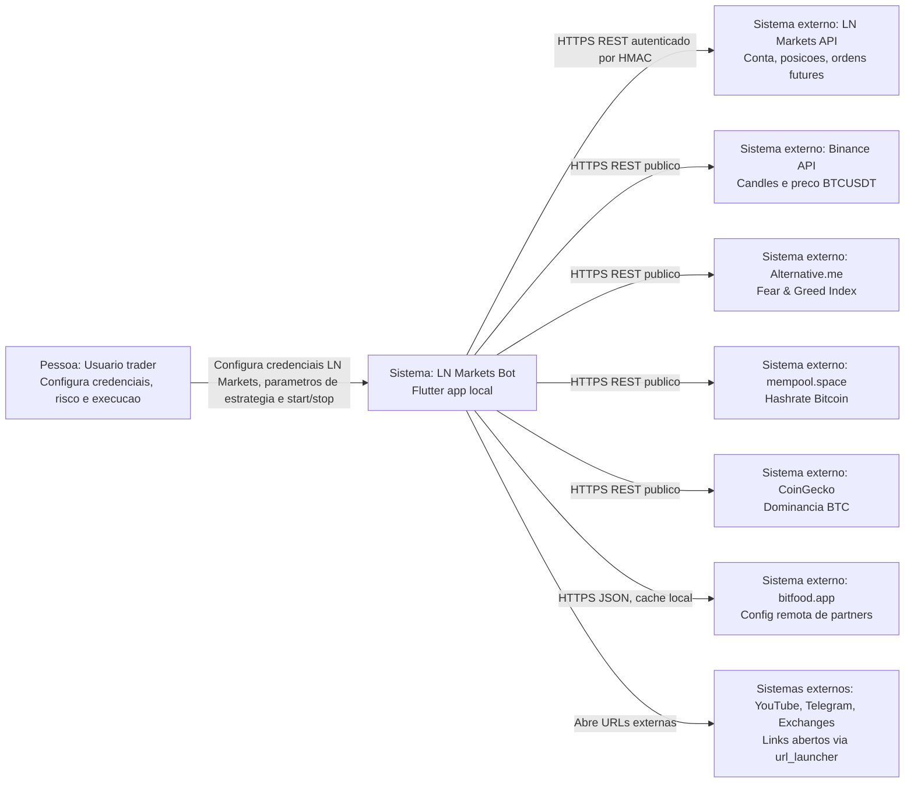

# C4 Contexto — LN Markets Bot

Gerado em: 2026-06-05T05:00:59Z

Escala de confianca: 🟢 **CONFIRMADO** — extraido diretamente do codigo; 🟡 **INFERIDO** — baseado em padroes; 🔴 **LACUNA** — requer validacao humana.

## Diagrama

## Relacionamentos

| Origem | Destino | Relacao | Evidencia | Confianca |
|---|---|---|---|---|
| Usuario trader | LN Markets Bot | Preenche credenciais, risco, estrategia, idioma e controla start/stop | `app/lib/screens/settings_tab.dart`, `app/lib/screens/dashboard_tab.dart` | 🟢 |
| LN Markets Bot | LN Markets API | Consulta conta/posicoes e abre/fecha ordens futures isoladas | `app/lib/services/lnmarkets_api.dart` | 🟢 |
| LN Markets Bot | Binance API | Busca candles e preco BTCUSDT | `app/lib/services/binance_api.dart` | 🟢 |
| LN Markets Bot | Alternative.me | Busca Fear & Greed | `app/lib/services/market_data_service.dart` | 🟢 |
| LN Markets Bot | mempool.space | Busca hashrate | `app/lib/services/market_data_service.dart` | 🟢 |
| LN Markets Bot | CoinGecko | Busca dominancia BTC | `app/lib/services/market_data_service.dart` | 🟢 |
| LN Markets Bot | bitfood.app | Busca config remota de exchanges parceiras | `app/lib/services/remote_config_service.dart` | 🟢 |
| LN Markets Bot | YouTube/Telegram/exchanges | Abre links externos | `app/lib/screens/settings_tab.dart`, `app/lib/screens/sponsors_tab.dart` | 🟢 |

## Fronteiras

- 🟢 Dentro do sistema: app Flutter local, logica de trading, UI, persistencia local e clients HTTP.
- 🟢 Fora do sistema: exchanges/APIs externas, dados de mercado, landing/config remota, canais sociais.
- 🟡 Infraestrutura de distribuicao/release nao esta modelada no codigo alem de scripts e artefatos versionados.
