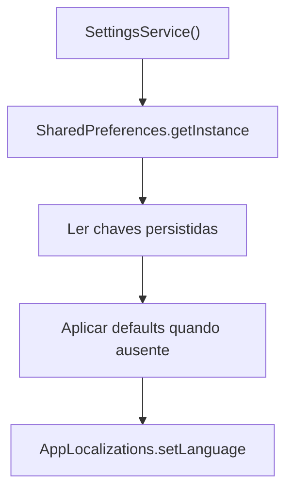
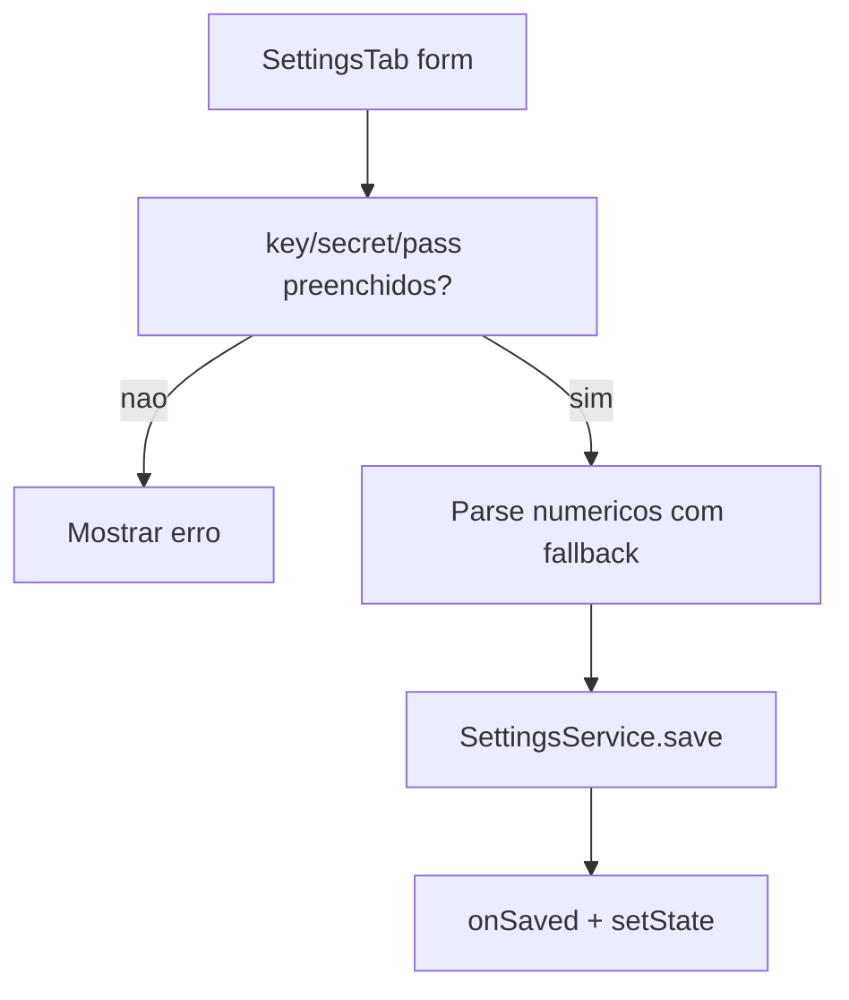

# Design — Configuracoes e Persistencia

## Componentes

| Componente | Responsabilidade | Confianca |
|---|---|---|
| `SettingsService` | Modelo mutavel e persistencia local de todas as opcoes. | 🟢 |
| `SettingsTab` | Formularios, parsing, validacao basica e salvamento. | 🟢 |
| `AppLocalizations` | Estado global de idioma e textos. | 🟢 |

## Fluxo de carregamento

## Fluxo de salvamento

## Modelo de dados

🟢 O modelo e uma classe mutavel, nao imutavel. Campos sao atualizados diretamente pela UI antes de `save()`.

🟢 `timeframe` tem default divergente: atributo inicial `1d`, mas `load()` usa fallback `15m`. Uma reimplementacao fiel deve preservar o fallback de `load()` como comportamento efetivo.

## Riscos

🔴 Credenciais sensiveis sao gravadas em `SharedPreferences`; uma implementacao nova deve decidir se preserva compatibilidade ou corrige para storage seguro.
