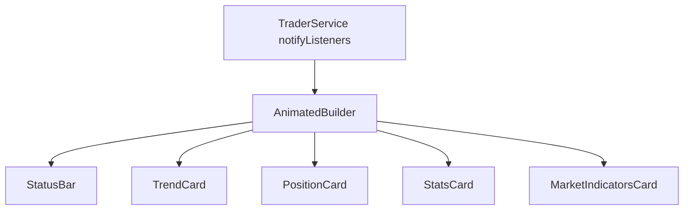
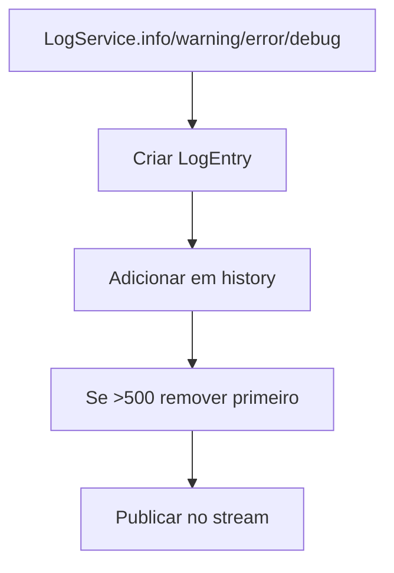

# Design — Dashboard e Logs

## Componentes

| Componente | Responsabilidade | Confianca |
|---|---|---|
| `DashboardTab` | Compor cards e observar `TraderService`. | 🟢 |
| `_StatusBar` | Status textual e botao start/stop. | 🟢 |
| `_TrendCard` | Sinal e EMAs. | 🟢 |
| `_PositionCard` | Side, entry, TP/SL e abertura. | 🟢 |
| `_StatsCard` | Contadores, runtime e P&L. | 🟢 |
| `_MarketIndicatorsCard` | Fear & Greed, hashrate e dominance. | 🟢 |
| `LogService` | Stream + historico de logs. | 🟢 |

## Fluxo Dashboard

## Fluxo Logs

## Regras visuais

🟢 Status stopped usa vermelho; running long usa verde; running short usa vermelho; running neutro usa amarelo.

🟢 P&L positivo usa verde, negativo usa vermelho e zero/amarelo conforme card.

🟢 `_MarketIndicatorsCard` inicia fetch no `initState` e agenda timer de 30 minutos.
