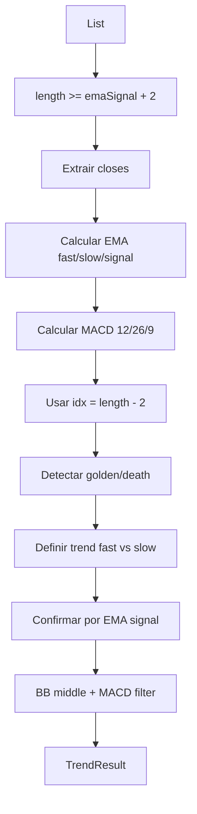

# Design — Estrategia e Indicadores

## Componentes

| Componente | Responsabilidade | Confianca |
|---|---|---|
| `Candle` | OHLCV vindo da Binance. | 🟢 |
| `TrendResult` | Resultado de sinal/filtros para trading e dashboard. | 🟢 |
| `Indicators` | Calculo de EMAs, BB middle, MACD e sinal. | 🟢 |

## Algoritmo

## Saida

`TrendResult` retorna:

- `signal`: `long`, `short` ou null.
- `cross`: `golden`, `death` ou null.
- `confirmed`: booleano pos confirmacao por EMA sinal.
- EMAs e preco arredondados para 2 casas.
- `bbFilter` e `macdFilter` para bloqueio de entradas long no trading engine.

## Observacoes

🟢 O filtro BB/MACD e calculado sempre, mas o trading engine o aplica somente a entradas long.

🟡 O README descreve EMA9/21/50; o codigo permite configurar esses periodos pela UI.
