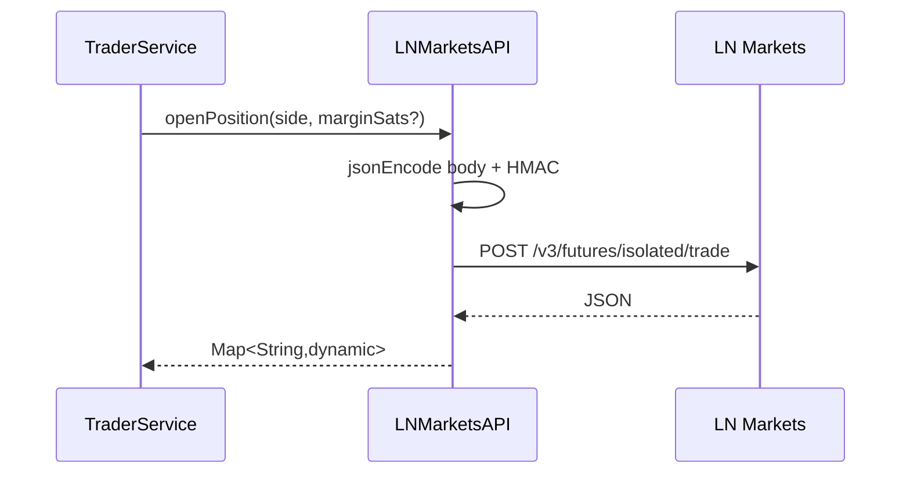

# Design — Integracoes de Mercado

## Clientes

| Cliente | Base URL | Autenticacao | Timeout | Confianca |
|---|---|---|---|---|
| `LNMarketsAPI` | settings mainnet/testnet | HMAC headers | 15s | 🟢 |
| `BinanceAPI` | `https://api.binance.com` | nenhuma | 10s candles, 5s preco | 🟢 |
| `MarketDataService` | varias APIs publicas | nenhuma | 10s | 🟢 |

## LN Markets

## Binance

🟢 `fetchCandles(interval, limit)` transforma a lista bruta de klines em `Candle(open, high, low, close, volume)`.

🟢 `fetchPrice()` retorna `double` parseado de `price`, ou `0` em status nao 200/parse invalido.

## Market data

🟢 As tres chamadas sao independentes e toleram falha individual com `catch (_) {}`.

## Riscos

🟡 Query string LN Markets e montada manualmente sem URL encoding em `_get()`. Hoje nao ha chamada GET com parametros no codigo observado.

🟡 Falhas silenciosas em market data podem esconder indisponibilidade de APIs externas.
