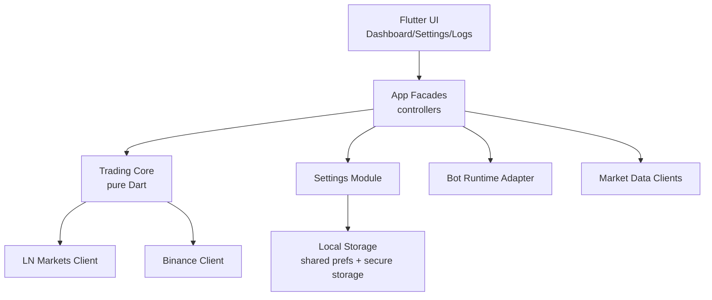

# Target Architecture

## Visao geral

O sistema alvo continua sendo um app Flutter local, mas com dominio e bordas separados. A UI observa facades; o core de trading nao depende de Flutter widgets nem de plugins de plataforma.

## Componentes

| Componente | Tipo | Responsabilidade |
|---|---|---|
| `core` | Dart puro | clock, result, serializacao comum, erros |
| `settings` | Dart + plugins | settings nao sensiveis e credenciais seguras |
| `trading` | Dart puro + adapters | indicadores, decisoes, estado de posicao e orquestracao |
| `market_data` | HTTP adapters | Binance, Alternative.me, mempool.space, CoinGecko |
| `logs` | Dart | stream limitado a 500 eventos |
| `platform` | adapters | runtime do bot por plataforma |
| `platform/macos` | macOS adapter | runtime foreground explicito enquanto app esta aberto |

## Honra ao paradigma escolhido

- UI declarativa Flutter permanece.
- Estado operacional fica em controllers finos.
- Dominio de trading ganha testes e interfaces.
- Plugins de plataforma ficam atras de adapters.

## Honra a topologia escolhida

Topologia hibrida: telas atuais podem permanecer no cutover inicial, mas passam a depender de facades da nova arvore `src`.
