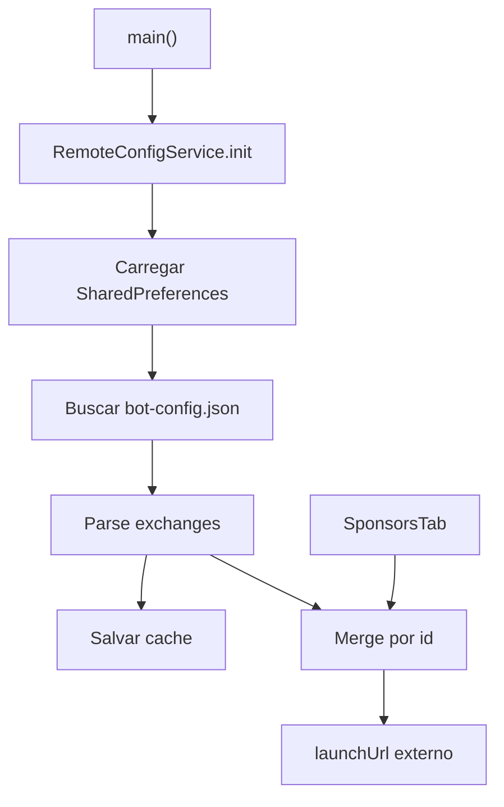

# Design — Patrocinadores e Config Remota

## Componentes

| Componente | Responsabilidade | Confianca |
|---|---|---|
| `SponsorService` | Registry local estatico de exchanges. | 🟢 |
| `RemoteConfigService` | Cache local + fetch remoto de overrides. | 🟢 |
| `SponsorsTab` | Merge local/remoto e cards clicaveis. | 🟢 |
| `SponsorBanner` | Banner resumido no layout. | 🟢 |

## Fluxo

## Merge

🟢 Para cada `Exchange` local:

- Procura `RemoteExchange` por `id`.
- Se encontrado, cria novo `Exchange` mantendo `name` e `tagline` locais.
- Usa `remote.signupUrl` quando nao vazio; caso contrario preserva o local.
- Usa `remote.live` para badge/estado.

## Estados visuais

🟢 `live=true` mostra badge `REFERRAL`; `live=false` mostra `EM BREVE`.

## Riscos

🟡 Nao ha validacao de dominio dos links remotos antes de `launchUrl`.
