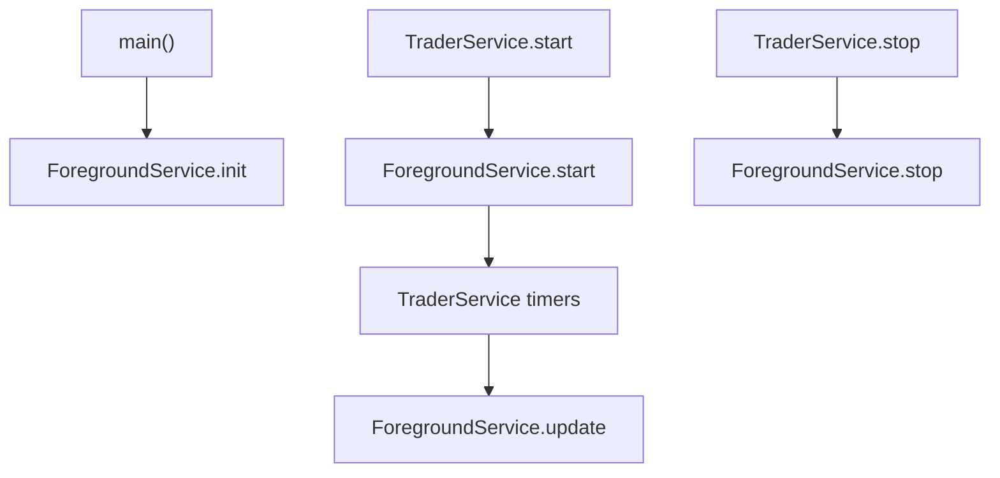

# Design — Servico em Background

## Componentes

| Componente | Responsabilidade | Confianca |
|---|---|---|
| `botForegroundEntryPoint` | Registrar task handler no isolate background. | 🟢 |
| `_BotTaskHandler` | Handler minimo; trading real fica na isolate principal. | 🟢 |
| `ForegroundService` | Facade estatica para init/start/update/stop/bateria. | 🟢 |

## Fluxo

## Decisao chave

🟢 O background task e um keep-alive; ele nao executa estrategia. O comentario em `onRepeatEvent` afirma que a logica real continua nos timers do `TraderService`.

## Degradacao

🟢 Todos os metodos publicos que chamam o plugin capturam excecoes. Reimplementacao deve preservar esse comportamento para nao impedir trading quando o foreground service nao estiver disponivel.
