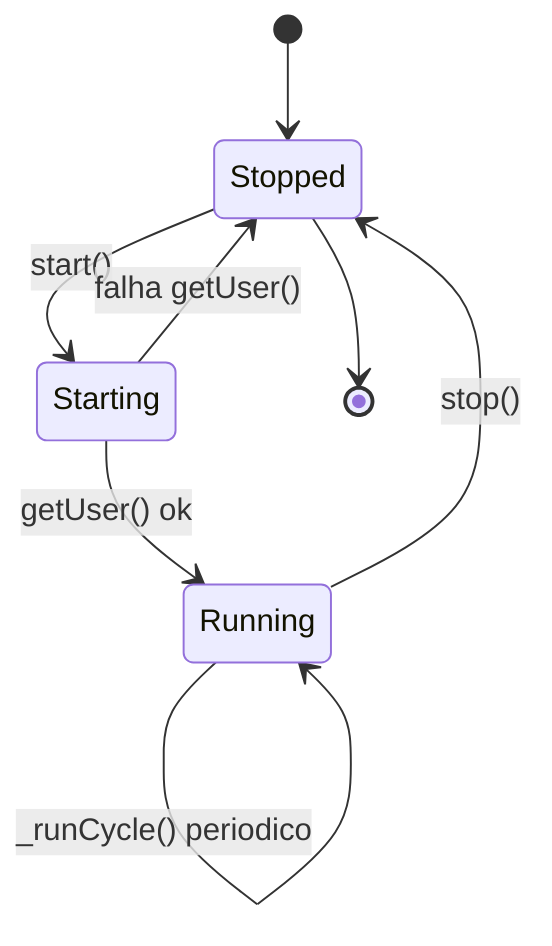
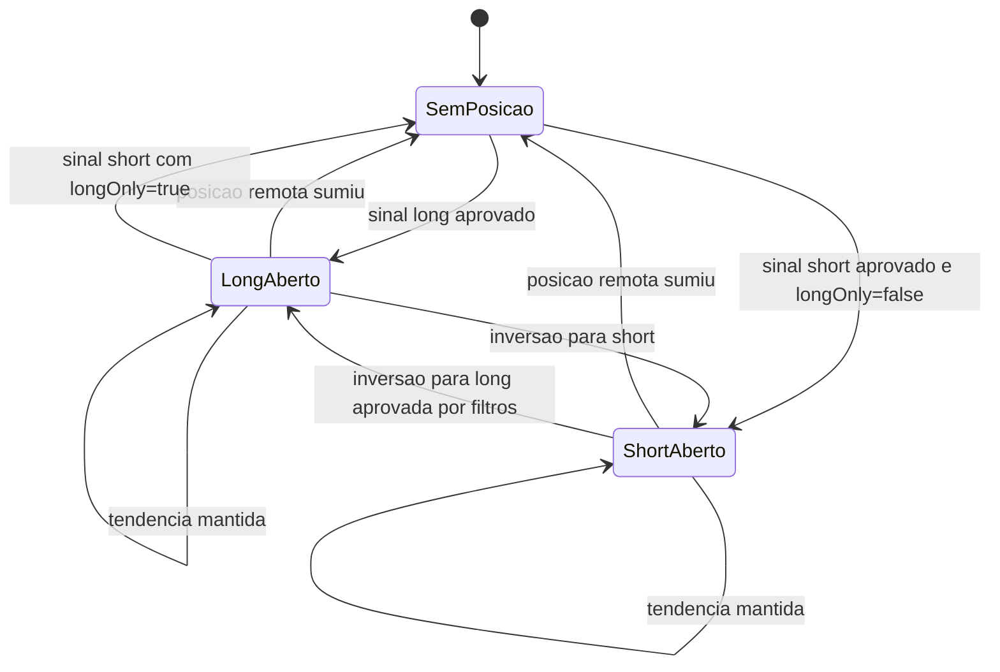
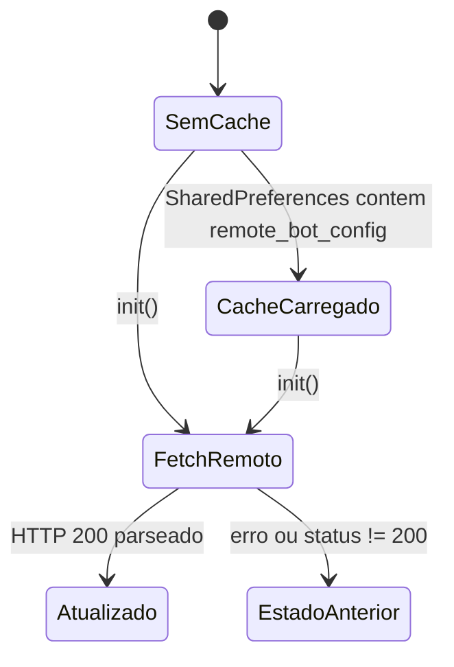

# Maquinas de Estado — LN Markets Bot

Gerado em: 2026-06-05T04:59:21Z

Escala de confianca: 🟢 **CONFIRMADO** — extraido diretamente do codigo; 🟡 **INFERIDO** — baseado em padroes; 🔴 **LACUNA** — requer validacao humana.

## Estado operacional do bot

🟢 **CONFIRMADO** O estado principal e `TraderService._running`, com timers e foreground service associados.

### Transicoes

| Origem | Evento | Destino | Evidencia | Confianca |
|---|---|---|---|---|
| `Stopped` | `start()` com `_running=false` | `Starting` | `app/lib/services/trader_service.dart:142-150` | 🟢 |
| `Starting` | falha em `_api.getUser()` | `Stopped` | `app/lib/services/trader_service.dart:152-159` | 🟢 |
| `Starting` | `_api.getUser()` ok | `Running` | `app/lib/services/trader_service.dart:152-170` | 🟢 |
| `Running` | timer do ciclo | `Running` | `app/lib/services/trader_service.dart:172-185` | 🟢 |
| `Running` | `stop()` | `Stopped` | `app/lib/services/trader_service.dart:188-197` | 🟢 |

## Estado de posicao

🟢 **CONFIRMADO** O estado local de posicao e definido por `PositionState.id`; `hasPosition` e verdadeiro quando `id != null`.

### Transicoes

| Origem | Evento | Destino | Evidencia | Confianca |
|---|---|---|---|---|
| SemPosicao | `effectiveSignal=long` e filtros BB/MACD ok | LongAberto | `app/lib/services/trader_service.dart:280-292` | 🟢 |
| SemPosicao | `effectiveSignal=short` | ShortAberto | `app/lib/services/trader_service.dart:280-292`, `app/lib/services/trader_service.dart:361-380` | 🟢 |
| LongAberto/ShortAberto | ID local nao existe nas posicoes remotas | SemPosicao | `app/lib/services/trader_service.dart:226-234` | 🟢 |
| LongAberto | `longOnly=true` e `signal=short` | SemPosicao | `app/lib/services/trader_service.dart:332-347` | 🟢 |
| LongAberto/ShortAberto | sinal oposto efetivo | Direcao oposta ou SemPosicao | `app/lib/services/trader_service.dart:303-329` | 🟢 |
| LongAberto | trailing habilitado e novo SL maior | LongAberto | `app/lib/services/trader_service.dart:247-264` | 🟢 |

## Estado de config remota de parceiros

🟢 **CONFIRMADO** A config remota tem cache local e fetch em background; falhas sao ignoradas.

### Transicoes

| Origem | Evento | Destino | Evidencia | Confianca |
|---|---|---|---|---|
| SemCache/CacheCarregado | `RemoteConfigService.init()` | FetchRemoto | `app/lib/services/remote_config_service.dart:34-39` | 🟢 |
| FetchRemoto | HTTP 200 | Atualizado | `app/lib/services/remote_config_service.dart:49-59` | 🟢 |
| FetchRemoto | excecao/status != 200 | EstadoAnterior | `app/lib/services/remote_config_service.dart:49-60` | 🟢 |
