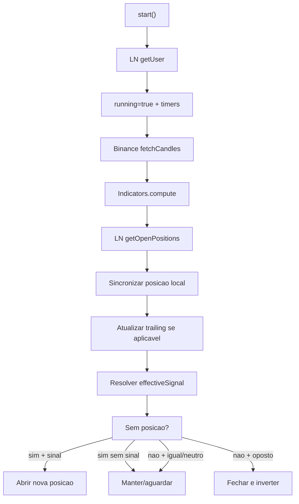

# Design — Trading Automatizado

## Componentes

| Componente | Responsabilidade | Confianca |
|---|---|---|
| `TraderService` | Estado observavel, timers, ciclo de trading, P&L e posicao. | 🟢 |
| `PositionState` | Snapshot local da posicao aberta. | 🟢 |
| `SessionStats` | Contadores e P&L da sessao atual. | 🟢 |
| `LNMarketsAPI` | Conta, posicoes, ordens e TP/SL. | 🟢 |
| `BinanceAPI` | Candles e preco. | 🟢 |
| `Indicators` | Sinal e filtros. | 🟢 |

## Ciclo principal

## Formulas

- 🟢 Compound margin: `round(balance * compoundingPct / 100).clamp(1000, balance)`.
- 🟢 TP long: `entry * (1 + tp/100)`.
- 🟢 TP short: `entry * (1 - tp/100)`.
- 🟢 SL long: `entry * (1 - sl/100)`.
- 🟢 SL short: `entry * (1 + sl/100)`.
- 🟢 Trailing long: `price * (1 - trailingStopPct/100)`, apenas se maior que o trailing atual.

## Persistencia

🟢 `PositionState` e salvo como JSON na chave `bot_position`. Campos: `id`, `side`, `entry_price`, `tp_price`, `sl_price`, `trail_sl_price`, `opened_at`.

## Erros

🟢 Erros de indicadores e posicoes encerram apenas o ciclo atual. Erros ao abrir/fechar posicao sao logados. Algumas atualizacoes periodicas ignoram excecoes.
